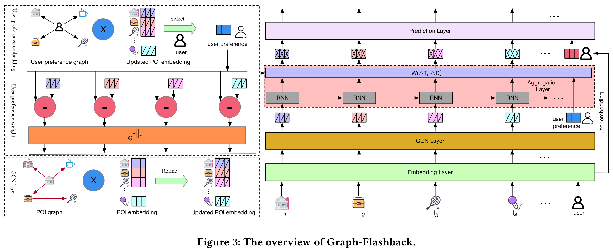

# SIGKDD 2022. Graph-Flashback Network for Next Location Recommendation

# Requirements
```
pip install -r requirements.txt
```

# Data Preparation

**1. place [flashback_data.zip](https://drive.google.com/file/d/1QXdpp0_QesJo7NZdhvoafg4MlpI_Bx-O/view?usp=sharing) into Graph_Flashback/data/ and unzip the file as following:**

Graph_Flashback/data/checkins-gowalla.txt

Graph_Flashback/data/checkins-4sq.txt

<!-- https://drive.google.com/file/d/1ST6GQidWVlR6yQle38MfPUSUc29t9xIT/view?usp=sharing -->

**2. place [Graphs.zip](https://drive.google.com/file/d/1KC361Gq-K-0Aw7xu5pyl51YOgMK9JtMb/view?usp=sharing) into Graph_Flashback/KGE/ and unzip the file as following :**

Graph_Flashback/KGE/Graphs/gowalla_scheme2_transe_loc_temporal_100.pkl

**3. Optional, the [pretrained-model](https://drive.google.com/file/d/1oUXQjtnDrUnmdhVSGY64WrXBngzD1qhz/view?usp=sharing) are also provided, you can unzip the file into "data/" (e.g., Graph_Flashback/data/pretrained-model/gowalla_schema2) and use "scripts/construct_graphs.sh" for generating the graphs in this paper. (If you are interested in the code of pre-trained model, you can find the download link [here](https://github.com/kevin-xuan/Graph-Flashback/issues/1#issuecomment-1235372011)) (including processed triplets files)**. Otherwise, we also provide the pure source code for training your models on your own datasets [here](https://github.com/kevin-xuan/KGE), which needs to construct your triplets files. See Section [Training new datasets](#Training-new-datasets) for details.

**4. The friend datasets have been uploaded into the [data file](https://github.com/kevin-xuan/Graph-Flashback/tree/main/data). You can also download the user profile file by the link presented in Section 6 "EXPERIMENTS" in our paper.**

<!-- 再将poi_graph.zip放到根目录的KGE文件夹下解压后得到36个graph.pkl文件，目录如下：

Graph_Flashback/KGE/gowalla_scheme1_transh_loc_temporal_20.pkl -->


<!--https://drive.google.com/file/d/14l-LzoD-T3y3SAP_GU05SKAeGob6uZrX/view?usp=sharing 

下载user_loc_graph.tar

**将user_loc_graph.tar放到根目录的KGE文件夹下解压，目录如下：**

Graph_Flashback/KGE/gowalla_scheme2_transe_user-loc_50.pkl-->

# Model Training

Gowalla
```
python train.py --trans_loc_file KGE/Graphs/gowalla_scheme2_transe_loc_temporal_100.pkl --trans_interact_file KGE/Graphs/gowalla_scheme2_transe_user-loc_100.pkl --log_file results/log_gowalla
```

Foursquare
```
python train.py --dataset checkins-4sq.txt --trans_loc_file KGE/Graphs/foursquare_scheme2_transe_loc_temporal_20.pkl --trans_interact_file KGE/Graphs/foursquare_scheme2_transe_user-loc_100.pkl --log_file results/log_foursquare
```
# Training new datasets
In order to train your model on your own datasets, you should run "generate_triplet.py" by modifying some default settings such as **dataset_file** and **DATA_NAME**=<your_dataset_name> in this [line](https://github.com/kevin-xuan/Graph-Flashback/blob/a1f18b793f22af3b62f212030fafd8c5f5624699/KGE/constant.py#LL1C40-L1C40) and "refine.py" to extract the final triplets files as follows:

```
cd KGE
python generate_triplet.py --dataset <your_dataset>.txt --friendship <your_friend>.txt 
python refine.py
```

Moreover, we provide the **KGE** code by the [link](https://github.com/kevin-xuan/KGE), and you should **delete** the two original txt files: "final_test_triplets.txt" and "final_train_triplets.txt" and **rename** the "new_final_test_triplets.txt" into "final_test_triplets.txt", so do "new_final_train_triplets.txt", and copy the directory **gowalla_scheme2** (i.e., './KGE/gowalla/gowalla_scheme2/') into the corresponding dir in KGE code, e.g., './datasets/gowalla/kg/'. 
The **"relation2id.txt"** is provided and used in same way, and the corresponding file name mapping is as follows:
```
entity2id.txt -> e_map.txt
final_train_triplets.txt -> train.txt
final_test_triplets.txt -> test.txt
relation2id.txt -> r_map.txt
```
Finally, using your pre-trained model to construct the location graph by the [construct_loc_loc_graph.py](https://github.com/kevin-xuan/Graph-Flashback/blob/3d5d42bbd50e39d797564a3aa880232ffcaccdb5/KGE/construct_loc_loc_graph.py#L162), for example (see **scripts/construct_graphs.sh**),

```
cd KGE
python construct_loc_loc_graph.py --model_type transe --dataset <your_data_name> --pretrain_model <your_pretrained_model> --version scheme2 --threshold 10 --user_count 10000 --loc_count 10000 
```
As for training the corresponding Graph-Flashback model, please refer to [Model Training](#model-training) or (see **scripts/run.sh**) .

# Acknowledgements
- [Flashback](https://github.com/eXascaleInfolab/Flashback_code) The model architecture of Graph-Flashback follows Flashback.
- [joint-kg-recommender](https://github.com/TaoMiner/joint-kg-recommender) The used Knowledge Graph Embedding ([KGE](https://github.com/kevin-xuan/KGE)) method to obtain the pretrained model follows joint-kg-recommender.
# Citing
If you use Graph-Flashback in your research, please cite the following [paper](https://dl.acm.org/doi/10.1145/3534678.3539383):
```
@inproceedings{DBLP:conf/kdd/RaoCLSYH22,
  author    = {Xuan Rao and
               Lisi Chen and
               Yong Liu and
               Shuo Shang and
               Bin Yao and
               Peng Han},
  title     = {Graph-Flashback Network for Next Location Recommendation},
  booktitle = {{KDD} '22: The 28th {ACM} {SIGKDD} Conference on Knowledge Discovery
               and Data Mining, Washington, DC, USA, August 14 - 18, 2022},
  year      = {2022}
}
```
